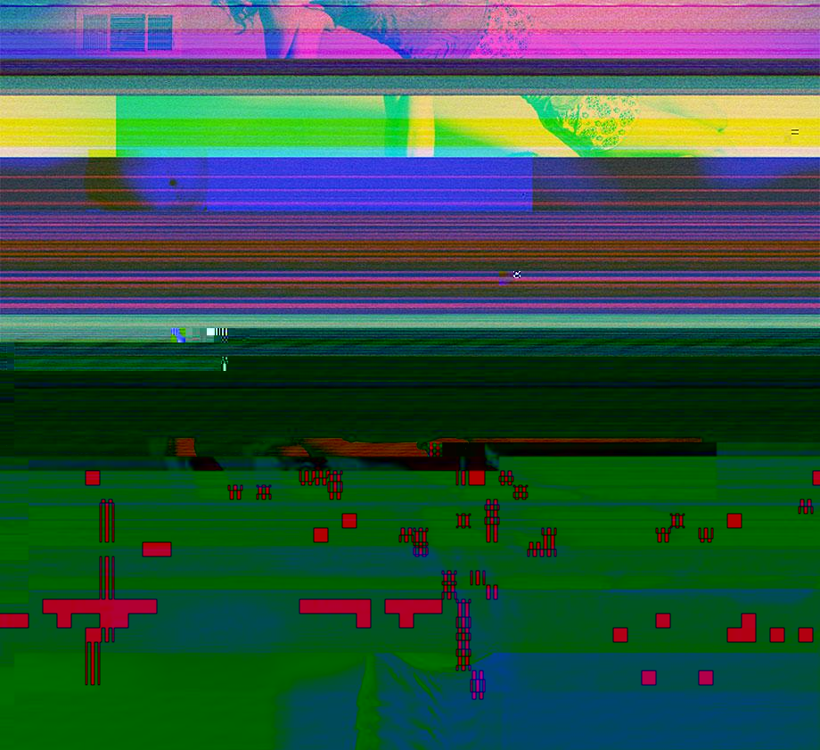

# Adrian

This project is an image glitcher inspired in the art gallery [To Adrian Rodriguez, With Love by Melanie Willhide](https://petapixel.com/2013/04/23/photographer-thankful-to-laptop-thief-for-new-creative-direction/). The picture that is in the top of this file is called [Beefcake and Betsy](https://slate.com/culture/2013/01/melanie-willhide-to-adrian-rodriguez-with-love-photos.html) after three levels of the glitcher.

> This project is meant to be used as a command line interface but feel free to add it anywhere.

## What this does?

It just glitches out (preferably JPEG) images, and with some luck you could generate crazy looking glitchy images.

## Requirements

  * Go 1.14
  * Unix system

## Installing

```console
$ git clone https://github.com/manoloesparta/adrian && cd adrian
$ go build
$ sudo cp adrian /usr/local/bin/
```

## Usage

```
adrian -f [input file] -l [levels] -o [output file]

  -f string
    	Path of jpeg to corrupt (Required)
  -l int
    	How cooked you want your corrupted jpeg (default 3)
  -o string
    	The name of the corrupted file (default "output.jpeg")
```

## License

This project is under the MIT License
